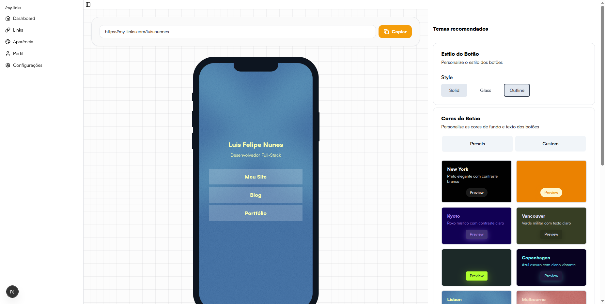

# biosite

<div align="center">



**Seu microsite multi-link com cara de produto premium.**

[](https://nextjs.org/)
[](https://www.typescriptlang.org/)
[](https://tailwindcss.com/)
[](https://www.prisma.io/)
[](https://tanstack.com/query)

</div>

## Visão rápida

biosite centraliza todos os seus links em um microsite responsive, com editor em tempo real e presets que já nascem prontos para conversão. A proposta é ser simples de operar, mas flexível o bastante para times que trabalham com branding, afiliados ou influenciadores.

## O que vem pronto

- Editor visual com preview dentro de um mock do iPhone 15.
- Biblioteca de presets (Nova York, Buenos Aires, Kyoto, etc.) + customização fina de cores, botões e sombras.
- Providers para aparência, autenticação e páginas ativas, reduzindo acoplamento.
- Métricas de clique via API pública sem depender de sessão.
- Deploy pronto para Vercel (`https://biosite.vercel.app/<slug>`).

## Stack

| Camada | Tecnologia |
| --- | --- |
| Interface | Next.js 15 (App Router) + TypeScript 5 |
| UI kit | Tailwind CSS + shadcn/ui |
| Estado remoto | TanStack Query + axios clients (`api` e `publicApi`) |
| Persistência | Prisma ORM + Postgres |
| Motion | Framer Motion |

## Primeiros passos

```bash
git clone https://github.com/Luis-Felipe-N/biosites.git
cd biosites
npm install
cp .env.example .env.local
npm run dev
```

> Landing em `http://localhost:3000`, auth em `/login` e estúdio em `/admin/<slug>/appearance`.

Scripts principais:

- `npm run dev` – desenvolvimento com Turbopack.
- `npm run build` – bundle otimizado para produção.
- `npm run lint` – checagens ESLint + TypeScript.

## Mapa do projeto

```
src/
├─ app/
│  ├─ (auth)/          fluxos de login/register
│  ├─ admin/[slug]/    estúdio (appearance + links)
│  └─ [slug]/          página pública
├─ components/         ui, appearance, auth, admin, style
├─ contexts/           auth, appearance, active-page
├─ hooks/              use-pages, use-links, use-mobile
├─ lib/                presets, api clients, prisma helpers
└─ public/             assets e fontes
```

## Customização

O `AppearanceProvider` fornece métodos para presets e ajustes pontuais. Cada mudança dispara atualizações no preview e pode ser salva via `useUpdatePageTheme`.

```
loadPreset('new-york')
updateBackground({ color: '#101828', type: 'COLOR' })
updatebutton({
  type: 'FILL',
  properties: { borderRadius: '32px', boxShadow: '0 20px 30px -12px rgba(0,0,0,0.3)' }
})
```

## APIs expostas

| Método | Rota | Uso |
| --- | --- | --- |
| `POST` | `/sessions` | autentica e retorna token + usuário |
| `GET` | `/pages/:slug` | render pública / preview | 
| `PUT` | `/pages/:id/theme` | salva customização |
| `GET` | `/me/pages` | lista páginas do owner | 
| `POST` | `/links/:id/click` | tracking de cliques |

Clientes autenticados usam `api`; endpoints públicos usam `publicApi` para evitar redirects.

## Contribuindo

1. Faça fork e crie uma branch (`git checkout -b feature/minha-feature`).
2. Rode testes/lint antes do PR.
3. Abra pull request contra `main` com um resumo do que mudou.

## Licença & Autor

- MIT License
- **Luis Felipe Nunes** – [GitHub](https://github.com/Luis-Felipe-N) · [LinkedIn](https://www.linkedin.com/in/luis-felipe-n/)

<div align="center">
Feito com ❤️ e ☕
</div>

